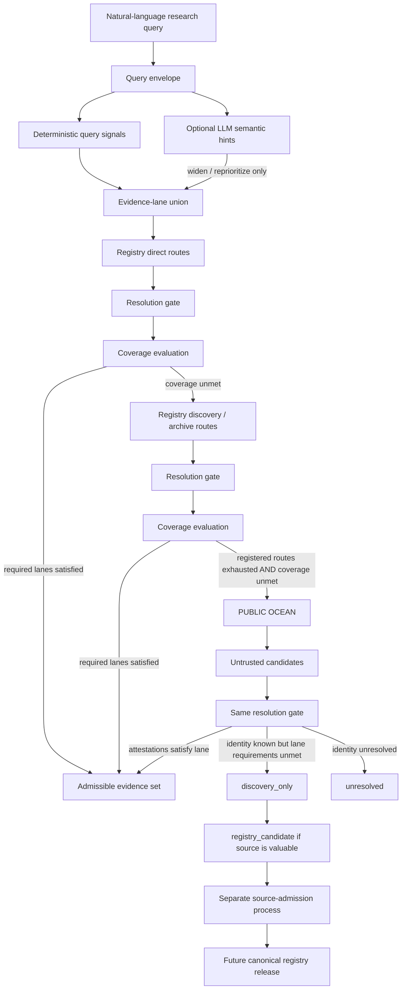
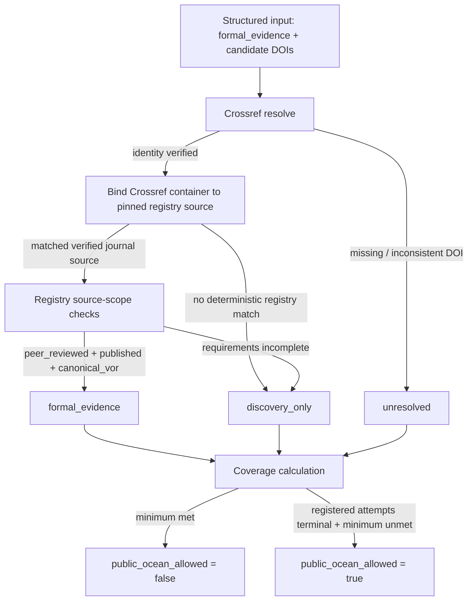

# Retrieval routing contract｜檢索路由契約

Open Scholarly Sources publishes a **registry-first, monotonic-fallback** routing policy for research agents and LLM-based consumers. The repository does not enforce runtime behaviour outside this project; it publishes a versioned contract, immutable release identity, conformance expectations and a minimal reference consumer.

本文件是給 LLM／agent 直接照著執行的使用契約。重點不是「先搜尋哪個網站」而已，而是把來源選擇、fallback、解析與證據升級權限分開。

## One rule to remember / 一條先記住

> **Uncertainty may widen the search, but may never upgrade evidence or close a required lane.**
>
> 不確定性只能把搜尋範圍加寬，不能把證據升級，也不能關掉原本要求的 evidence lane。

這是 `data/retrieval-routing-policy.json` 的 monotonic-widening 核心。若 consumer 使用 LLM 做語意判斷，LLM 可以建議多找一條 lane、增加 budget 或調整先後，但不能自己把 `unknown` 改成 `verified`，不能因為「看起來不重要」而停止 required lane，也不能把公海 PDF 直接升級成 formal evidence。

## LLM / agent quick-use procedure

執行研究查詢時依序做：

1. **Pin registry release.** 讀取 `release-manifest.json`，記住 `release_id`、`routing_policy_version` 與 source-profile rule version。需要 current-main freshness 時依 `RELEASE_CONSISTENCY.md` 比對 main ref。
2. **Build a query envelope.** 使用者明確指定的要求優先；沒有指定時用 policy 的 conservative default。`deterministic_query_signals` 只是高精度、刻意低召回的 widening signals，不是完整 intent detector。
3. **Expand companion lanes.** 對每個 requirement 加上 policy 指定的 companion lanes。多個 requirements 做 union，不做單選分類。
4. **Route through registered sources first.** 依 subject、access role、source profile tier/archetype 選 `registry_direct`；需要擴張時用 registry 已治理的 D1/A1 discovery/version infrastructure。
5. **Keep an attempt ledger.** 每個 planned route 必須落到 `success_with_candidates`、`success_empty`、`failed_after_policy_budget` 或 `not_applicable` 之一。
6. **Resolve candidates before admitting them.** 候選文件要進 resolution gate。只有 policy 接受的 resolver 能產生對應 attestation；LLM 自己不能寫 `verified`。
7. **Evaluate lane coverage after resolution.** 算的是 admissible documents，不是搜尋結果數。五十個 unresolved PDF 對 formal lane 仍然是 0。
8. **Open public ocean only when both conditions hold:** registered routes exhausted **and** required-lane coverage unmet。
9. **Public-ocean results must swim back through the same resolution gate.** 能開 PDF、能讀全文、看起來像期刊，都不能跳過 gate。
10. **Never promote a source into the canonical registry from a research runtime.** runtime 最多產生 `registry_candidate`；canonical admission 是獨立的 evidence-backed repo process。
11. **Emit a trace.** 若 consumer 聲稱遵守本 policy，至少保留 policy 指定的 trace fields；沒有 trace 只能說「使用了 Open Scholarly Sources」，不能聲稱「依 routing policy 執行」。

## Main flow / 主流程圖



### Do not invert this graph

錯誤做法：

```text
web search → downloadable PDF → answer → maybe inspect source later
```

合規做法：

```text
registry route → candidate → resolution → admissibility → answer
                                     ↑
public ocean → candidate ────────────┘
```

**公海是 escape hatch，不是第二條平行的 evidence authority。**

## Query envelope: deterministic core, optional semantic widening

`deterministic_query_signals` 使用字面 signal，目標是 high precision / intentionally low recall。沒有匹配到 `latest`、`guideline`、`撤稿` 等字眼，**不代表系統已判斷不需要對應 lane**；它只代表 deterministic 保底層沒有額外 signal。

LLM semantic hints 可以補這個 recall 缺口，但權限只有：

```text
ALLOW: widen, reprioritize
DENY:  exclude_lane, verify_evidence, promote_registry_source
```

因此「最近有沒有研究推翻既有共識」即使沒有字面 `latest`，LLM 可以加 `frontier_challenge`；但不能因為自己判斷這題「偏前沿」就取消 formal lane。

## Evidence lanes are composable / lane 不是九選一

常見搭配：

```text
formal_evidence
  + frontier_challenge   # 保留最新反例入口

frontier_research
  + formal_evidence      # 前沿訊號仍保留正式錨點

evidence_synthesis
  + formal_evidence

integrity_check
  + formal_evidence
```

完整 lane、preferred tiers/archetypes 與 admissibility requirements 以版本化 policy JSON 為準，不要從本文件自行推導新規則。

## Resolution gate / 解析閘門

Resolution 不使用一個含糊的 `canonical_verified=true`。它由可歸因的 machine / registry attestations 組成，例如：

```json
{
  "attestation_type": "document_identity",
  "status": "verified",
  "resolver": "crossref",
  "method": "doi_record",
  "identifier": "10.xxxx/example",
  "observed_at": "2026-08-17T00:00:00Z",
  "response_sha256": "..."
}
```

重要邊界：

- Crossref DOI resolve 成功，只證明 DOI record / document identity 類資訊；**不等於 peer review 已驗證**。
- `journal-article` 類型本身也不等於 peer-review proof。
- 來源已在 pinned Open Scholarly Sources release 中，且該 source record 已驗證 `peer_review_scope=peer_reviewed`、`publication_state=published`、具有 `canonical_vor` role 時，可由 registry 產生 source-scope attestation。
- 新公海來源若 peer-review scope 沒有被 accepted resolver 或既有 registry record 建立，預期會留在 `discovery_only`。這是刻意的保守行為，不是 retrieval failure。
- 出版社 editorial-policy 散文若需要人或 LLM 解讀，只能當 candidate evidence；一般 research runtime 不得因此自動產生 `verified` peer-review attestation。

## Coverage and fallback are computed states

`registry routes insufficient` 不靠一句自然語言判斷。每個 planned route 必須進 terminal state；required lane 再以 **resolution 後 admissible count** 判斷 coverage。

```text
registered_routes_exhausted
=
all planned registered routes for required lanes are terminal

coverage_unmet
=
any required lane has fewer admissible documents than its contract minimum

public_ocean_allowed
=
registered_routes_exhausted AND coverage_unmet
```

搜尋結果很多不代表 coverage 足夠；unresolved / discovery-only 候選不能拿來填 formal-evidence minimum。

## Lite vs verified

### Lite

Lite 的速度來自**重用 pinned registry 已經做過的 source-level verification**，不是把 gate 關掉。

```text
registered source + registry source-scope facts
    + minimal document identity resolution
    → possible admission

new / public-ocean source
    + only partial attestations
    → discovery_only or unresolved
```

Lite mode 不得比 verified mode 更容易接受證據。設計不變量：

```text
admissible_lite ⊆ admissible_verified
```

查得少，只能知道得少；不能因此更有自信。

### Verified

Verified mode 按 lane 跑完整 resolver set，並保存 resolver observation / digest。它可以把 lite 中 `unknown` 的候選升成 admissible，但不能改寫先前的 observation provenance。

## Public-ocean source promotion / 公海來源怎樣回到航海圖

研究 runtime 最多產生：

```text
observed
→ document_resolved
→ source_identity_resolved
→ registry_candidate
```

`registry_candidate` **不是 canonical source**。

來源晉升依 independent resolver families / evidence channels，而不是「不同 session 看過三次」。重複 session 只能增加 priority provenance，例如 observation count、last seen；它不增加真實性。

Canonical admission 仍要遵守本 repo 的 source schema、verification evidence、validator 與 review/merge boundary。`null` / `unknown` / `mixed` 優先於看起來合理的猜測。

## Reference consumer v0.1

`reference_consumer/route.py` 是最小可執行示範，不宣稱覆蓋完整研究檢索。它刻意只做：

```text
structured formal_evidence envelope
        ↓
candidate DOI(s)
        ↓
Crossref document-identity resolver
        ↓
optional pinned-registry source binding
        ↓
registry source-scope attestation
        ↓
formal_evidence / discovery_only / unresolved
        ↓
coverage verdict + public-ocean eligibility
```

它**不做**：

- 自然語言 intent classification
- 從出版社 prose 自動推斷 peer review
- DOAJ / Unpaywall / publisher version resolution
- source-specific discovery implementation
- 自動把新來源寫入 canonical registry

這些限制是 feature，不是待偷偷繞過的 blocker。v0.1 的目的是先證明 gate 真的能拒絕候選，以及 `coverage_unmet → public_ocean_allowed` 是可重跑狀態轉移。

### Reference-consumer flow



## Consumer trace

至少保留 policy 的 `trace_required_fields`。Reference consumer v0.1 會另外保留 deterministic binding method、Crossref response digest、admissibility reason 與 coverage verdict。

對外宣稱時請區分：

```text
"used Open Scholarly Sources"
```

和：

```text
"executed according to routing policy <version>/<digest> against registry release <sha>"
```

後者需要 trace 才成立。

## Runtime boundary / 誠實的系統邊界

`runtime_enforcement=false` 是刻意且公開的限制。這個 repo 能保證的是：

- 發布 canonical source facts
- 發布 deterministic source profiles
- 發布版本化 routing policy
- 把 policy/schema 納入 immutable release snapshot
- 提供 reference implementation 與 conformance tests

它不能強迫任何外部 agent 不去公海，也不能阻止某個 consumer 無視 resolution gate。外部系統若要聲稱 compliance，責任在 consumer 留下足夠 trace 供驗證。

## Reproducibility boundary

Policy 可以讓**routing decision**可重現，但外部 resolver 的世界會更新。若需要重現「當時為何得到這些候選」，consumer 應保存：

- resolver name / method
- observation timestamp
- request identifier/query digest
- candidate identifiers
- response digest（必要時保存原始 response artifact）

半年後用同一 policy 查 Crossref 得到不同候選，不代表 routing policy 非決定性；可能只是 resolver corpus 已改變。

## Version identity

Routing policy 是 release identity 的一部分。使用 mutable endpoint 時必須搭配 `release-manifest.json`；需要可重現歷史版本時，使用：

```text
/releases/<commit-sha>/retrieval-routing-policy.json
/releases/<commit-sha>/schemas/retrieval-routing-policy.schema.json
```

release manifest 同時記錄 routing policy version / method / schema version 與各檔案 SHA-256。不要只記「我用了最新版 policy」。
