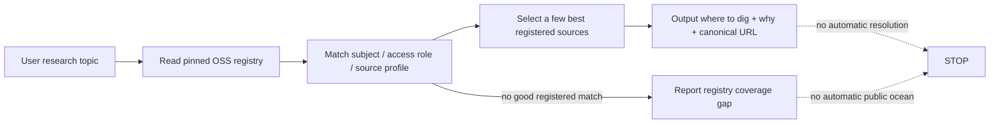
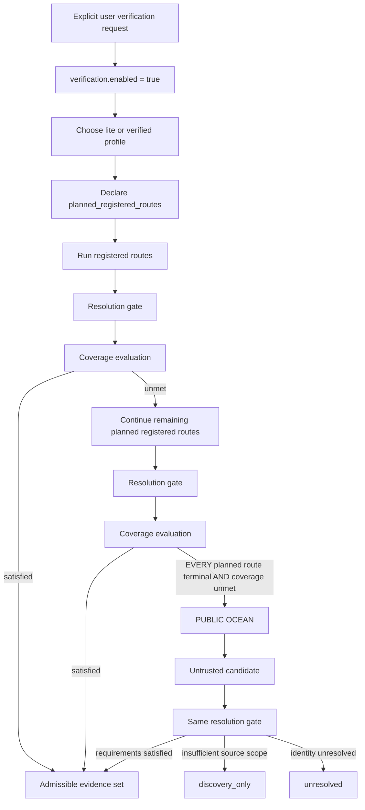

# Source navigation and optional verification｜來源導航與按需認證

Open Scholarly Sources is primarily a **map of where to dig for scholarly literature**.

本 repo 的預設用途很簡單：**LLM／agent 讀取 registry 後，只指出最值得去挖文獻的幾個已登錄學術來源。**

It is **not** a mandatory per-paper verification gateway. Crossref, DOAJ, Unpaywall, resolution attestations, admissibility classes and public-ocean fallback belong to a separate verification route that is activated only when the user explicitly asks for it.

版本化機器契約見 `data/retrieval-routing-policy.json`。

## Default rule / 預設規則

> **Find where to search first. Verify only when the user explicitly asks.**
>
> **先指出去哪裡挖；只有使用者明確要求時才啟動認證。**

Normal requests such as:

- 「找肌酸對神經系統的文獻」
- 「用 OA repo 找來源」
- 「有哪些期刊可以挖？」
- 「找最近的 LLM hallucination 研究」

**do not activate verification.**

預設不打 Crossref／DOAJ／Unpaywall，不建立 attestation，不判 `formal_evidence`／`discovery_only`，也不因 registry coverage 不足自動游向 public ocean。

## Default LLM flow / LLM 預設流程



Aim for roughly **5 sources**, never more than **8** unless the user asks for a broader list.

For each selected source, return useful navigation information only:

```text
source name
source id
organization / source type
why it is useful for this topic
canonical URL
```

The LLM may semantically rank registered sources using the query, but it must not invent source facts or silently upgrade OA / peer-review / publication claims beyond the pinned registry record.

## Explicit closed-registry OA search / 明確啟動封閉式 OA 搜尋

The user may ask the chatbot to go beyond navigation and actually search, while
still forbidding every source outside this registry. That activates the separate
`chatbot_closed_registry_oa_search_v1` protocol—not verification and not public ocean.

```text
explicit “only use this OA registry” request
→ pin one immutable release
→ select active registered sources
→ resolve each source's published topic-search adapter
→ exact-host HTTPS fetch
→ Content-Type + parser + redirect receipt
→ dedupe and report SUCCESS / NO_RESULTS / gaps
```

The canonical contract is `data/chatbot-search-routing.json`; the complete
instructions are in `CHATBOT_OA_SEARCH_PROTOCOL.md`. A registered source without
an adapter returns `NO_SEARCH_ADAPTER`. A timeout, 429, HTTP error, wrong
Content-Type or parse failure returns `SOURCE_FETCH_GAP`. Neither means that the
topic has no literature, and neither permits general web search as fallback.

This mode needs no Skill, MCP or custom server. Its allowlist is a published,
auditable consumer contract rather than a network firewall, so
`runtime_enforcement=false` remains truthful.

## Example / 使用例

User:

```text
找肌酸對神經系統的 OA 文獻
```

Correct default behavior:

```text
Open Scholarly Sources suggests these places to dig:
- PubMed / Europe PMC — biomedical discovery and linked article metadata
- PubMed Central — OA full-text recovery when an article is archived there
- relevant registered life-health journals / portfolios
- cross-disciplinary discovery infrastructure if useful

Then search those sources for creatine + cognition / sleep deprivation / brain / neurological terms.
```

Wrong default behavior:

```text
find candidate paper
→ Crossref DOI gate
→ exact journal binding
→ registry_source_scope
→ reject paper as discovery_only
```

The latter workflow is verification, not navigation. It must not happen merely because the user asked to find literature.

## Verification is opt-in / 認證路由必須由使用者啟動

Verification starts only after an explicit user request such as:

```text
核實這些文獻
驗證來源
啟動認證路由
跑 verification gate
做 source audit
check these papers formally
```

An LLM may **not** self-activate verification because a topic looks medical, important, controversial or high quality. A host application may impose its own safety/compliance requirements, but that is outside the Open Scholarly Sources default contract.

When verification is explicitly enabled, the caller must carry an activation object:

```json
{
  "verification": {
    "enabled": true,
    "profile": "lite",
    "requested_by": "user"
  }
}
```

No explicit user activation → no reference verification run.

## Optional verification flow / 按需認證流程



Within this optional verification route:

> **Uncertainty may widen the search, but may never upgrade evidence or close a required lane.**

不確定性可以讓認證搜尋變寬，但不能讓證據升級，也不能關閉 required lane。

## Route exhaustion must be plan-complete

`registered_routes_exhausted` is not allowed to mean「目前有回報的 attempts 剛好都 terminal」。That creates a loophole where omitted routes silently disappear and public ocean opens too early.

Verification must first declare:

```json
{
  "planned_registered_routes": [
    {"route_id": "formal:tacl", "lane": "formal_evidence", "source_id": "tacl"},
    {"route_id": "formal:second", "lane": "formal_evidence", "source_id": "second-source"}
  ]
}
```

Every attempt carries the same stable `route_id`. Exhaustion becomes true only when **every planned route has exactly one terminal attempt**.

```text
registered_routes_exhausted
=
every planned_registered_route has one terminal attempt
```

A missing attempt keeps exhaustion false. An attempt for a route that was never planned is rejected by the reference consumer.

## Verification profiles

### `lite`

Explicit opt-in only. Reuses pinned registry source facts and demonstrates minimal Crossref document-identity resolution.

```text
resolver classes: registry + Crossref
```

Lite is not the default repo behavior. It is a cheaper verification profile.

### `verified`

Explicit opt-in only. May use the resolver families required by the requested lane:

```text
registry
Crossref
DOAJ
Unpaywall
publisher
relevant disciplinary authority
```

More resolution may make an unknown candidate admissible. Less checking may never create a stronger claim.

## Resolution boundaries

When verification is enabled:

- Crossref DOI resolution can establish document-identity metadata; it does **not** prove peer review.
- `journal-article` is not a peer-review attestation.
- A pinned registry record may provide source-level facts already verified by this project.
- A new source whose peer-review scope cannot be established may remain `discovery_only`.
- Publisher-policy prose requiring human or LLM interpretation is candidate evidence, not automatic `verified` status.
- Public-ocean candidates cannot bypass the same resolution gate.

These restrictions apply to **verification mode**. They must not be used to suppress ordinary source navigation.

## Public ocean boundary

Public ocean is part of optional verification fallback, not normal source recommendation.

It may open only when all three conditions hold:

```text
verification_enabled
AND registered_routes_exhausted
AND coverage_unmet
```

`registered_routes_exhausted` additionally requires complete planned-route accounting as described above.

Default source navigation never opens public ocean by itself. If no suitable registered source exists, report a registry coverage gap instead.

## Source promotion boundary

Even inside verification, a research runtime may only create a `registry_candidate`.

```text
observed source
→ identity resolved
→ registry_candidate
→ separate repo admission / evidence / review process
→ future canonical source
```

Repeated sessions are not independent truth evidence. Admission relies on appropriate evidence channels and the normal repo validation/review boundary.

## Reference implementation

The executable verification reference entry point is:

```text
reference_consumer/verify.py
```

`reference_consumer/route.py` contains lower-level Crossref and source-binding primitives. It is not the default LLM literature-discovery path.

Run the opt-in verification example with:

```bash
python3 reference_consumer/verify.py \
  --input examples/reference-consumer-formal-evidence.json
```

The reference consumer currently covers only a small formal-evidence candidate gate. It exists to prove that the verification contract is executable, not to turn every literature search into a gate run.

## Regression rule: do not repeat the creatine failure

A prior smoke-test pattern exposed the failure mode this v2 contract prevents:

```text
OA biomedical papers found successfully
→ Lite verification auto-runs
→ journal not represented as exact registry journal record
→ registry_source_scope cannot be established
→ every useful paper becomes discovery_only
→ literature search appears to return zero formal papers
```

That behavior is acceptable **only when the user explicitly requested verification**. It is a bug if it happens during ordinary literature discovery.

Consumers should treat this as a regression invariant:

```text
ordinary find/recommend/search request
→ source_navigation
→ zero resolver calls required by OSS policy

explicit verify/audit request
→ optional verification route
```

## Version and reproducibility

Routing policy identity is included in the release manifest and immutable release snapshot. A consumer that performs verification and claims policy compliance should preserve the verification trace fields defined by the pinned policy, including `planned_registered_routes` and `route_attempts`.

Default source navigation does not need a resolution trace. It should still identify the registry release when exact reproducibility matters.

The repository publishes this contract but does not control arbitrary external runtimes (`runtime_enforcement=false`).
